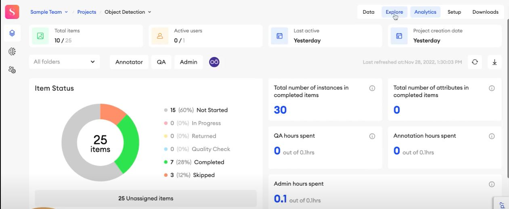
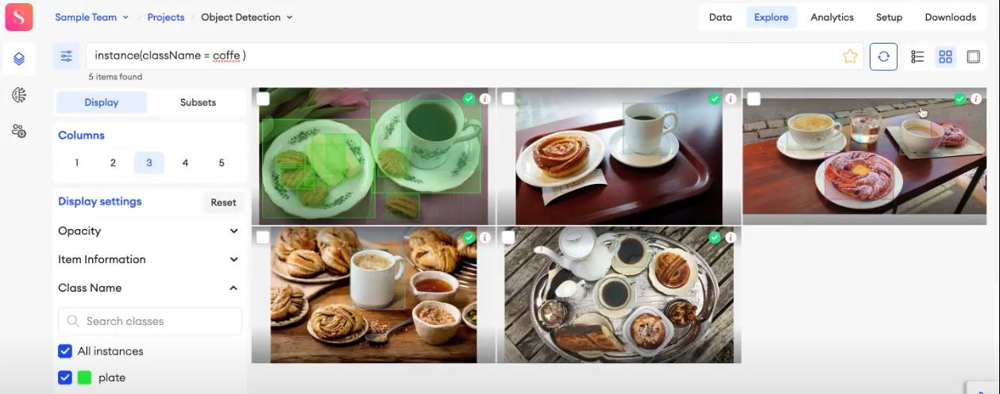

# WHAT IS GOOD ABOUT USING SUPERANNOTATE IN DATA LABELLING PROCESS

## 1. First thing that I noticed is their interface looks much simpler than that of "V7labs"

## 2. Analytics
They have a very good data visualisation page where all the data analystics can be seen (its close to what we wanna implement)

## 3. Filter out feature 
With this, a specific data instance can be filtered out with its class name or attributes and then can be reviewed or updated

## 4. And they have the Azure integration that makes it easier to ingest data from
